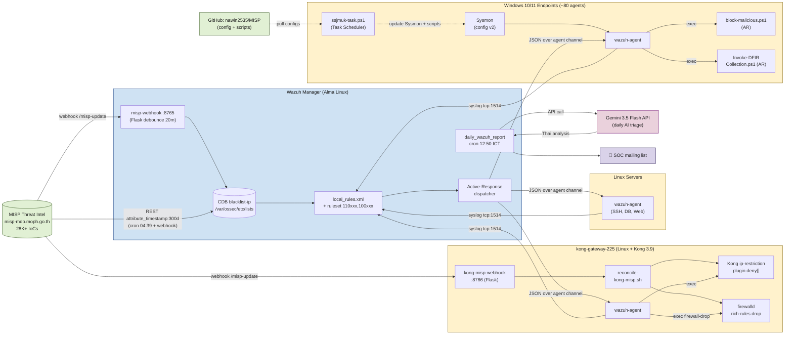
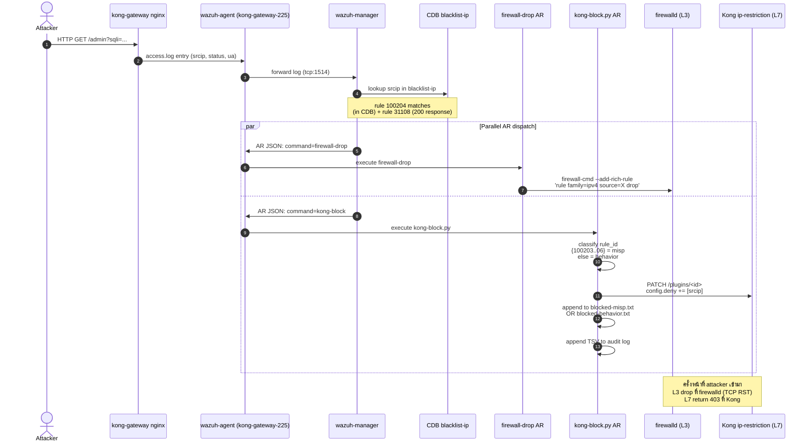
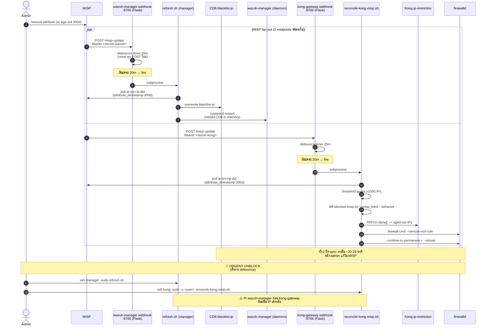
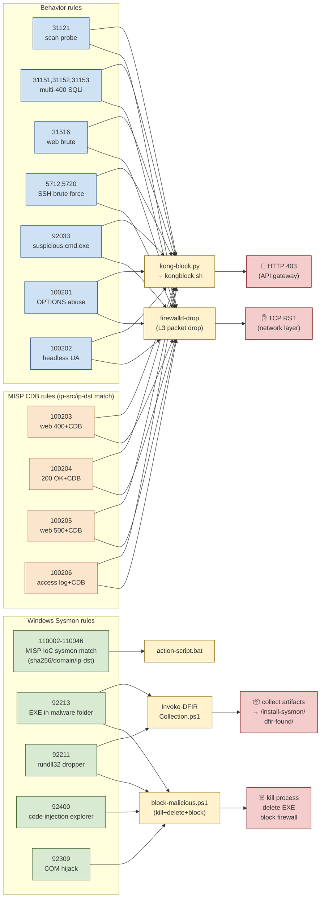
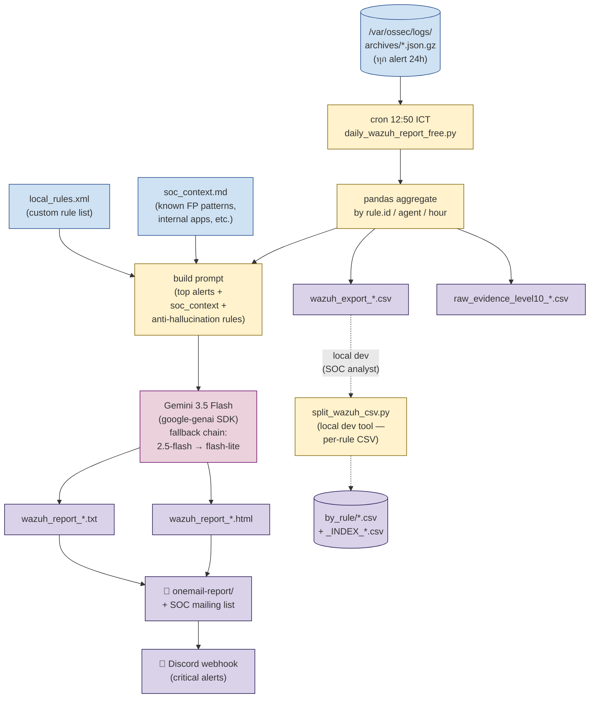
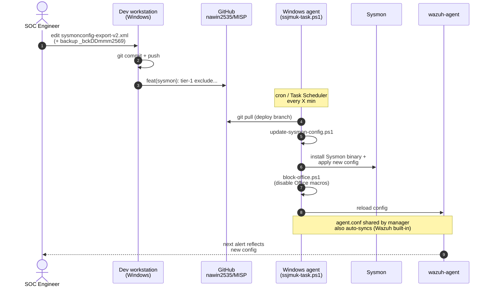

# SOAR Architecture — Wazuh + MISP + Kong Gateway

> SOC ของหน่วยงานสาธารณสุข — บูรณาการ MISP threat feed กับ Wazuh SIEM
> เพื่อทำ Detection → Active Response → Auto-Cleanup → AI-assisted Daily Report
>
> โครงการรวม:
> - MISP feed pulled into Wazuh CDB (`blacklist-ip`)
> - Wazuh rules detect threats on Linux servers, Kong gateway, Windows endpoints
> - Active Response (AR) blocks at L3 (firewalld) + L7 (Kong) + Windows host (kill/delete)
> - Self-healing: aged-out MISP IoCs auto-unblocked from Kong
> - Daily AI report (Gemini 3.5 Flash) of all alerts

---

## 1. ภาพรวมระบบ (High-level Architecture)



---

## 2. Detection + Block Pipeline (เมื่อ attacker มา ติดเข้าระบบ)



---

## 3. MISP Sync + Auto-unblock Pipeline (Self-healing)



---

## 4. Active Response Matrix (rule → AR → effect)



---

## 5. Daily Report Pipeline (AI-Assisted Triage)



---

## 6. Config Distribution (GitHub → Endpoints)



---

## 📂 Source Tree Reference (สำคัญ)

```
C:\install-sysmon\                              ← repo root
├── .claude/                                     ← project docs (gitignored)
│   ├── project_instructions.md
│   ├── investigation_playbook.md
│   ├── suppression_methodology.md               ← 3-tier upstream-first
│   └── ...
├── sysmonconfig-export-v2.xml                   ← Sysmon config (2895 lines)
├── ssjmuk-task.ps1                              ← Task Scheduler entry
├── update-sysmon-config.ps1                     ← Sysmon installer
├── block-office.ps1                             ← Office macro restriction
├── Invoke-DFIRCollection.ps1                    ← DFIR AR
├── wazuh/
│   ├── active-response/bin/
│   │   └── block-malicious.ps1                  ← Windows AR (kill+delete+block)
│   ├── script-export-ioc/
│   │   ├── export_misp_to_wazuh.py              ← MISP → CDB (Python)
│   │   ├── misp_to_wazuh.sh                     ← MISP → blacklist-ip (bash)
│   │   ├── test-misp-restsearch.{ps1,sh}        ← REST probe tools
│   │   └── reformat_misp_sha256.sh              ← Wazuh CDB format helper
│   └── misp-webhook/
│       ├── app.py.example                       ← Flask receiver port 8765
│       ├── refresh.sh.example
│       └── logrotate.misp-webhook.example
├── kong-gateway/
│   ├── kong-setup/
│   │   ├── docker-compose.yml                   ← Kong + Postgres + Konga + ...
│   │   ├── kongblock.sh                         ← Kong API + manifests + audit
│   │   ├── reconcile-kong-misp.sh               ← Auto-unblock aged-out IPs
│   │   ├── sudoers-kong-reconcile.example
│   │   └── reconcile-kong-misp.cron.example
│   ├── misp-webhook/
│   │   ├── app.py.example                       ← Flask receiver port 8766
│   │   ├── refresh.sh.example
│   │   ├── kong-misp-webhook.service.example    ← systemd unit
│   │   └── logrotate.kong-misp-webhook.example
│   ├── wazuh/active-response__bin/
│   │   └── kong-block.py.example                ← AR classifier (MISP vs behavior)
│   └── pipeline.md                              ← end-to-end flow reference
├── wazuh-export-log/wazuh_daily_report_v3_update13may2569/
│   ├── daily_wazuh_report_free.py               ← daily AI report (cron 12:50)
│   ├── wazuh_ai.py                              ← Gemini API wrapper
│   ├── wazuh_config.py                          ← env + fallback chain
│   ├── wazuh_prompt.py                          ← prompt template
│   ├── soc_context.md                           ← known FP knowledge base
│   ├── local_rules.xml                          ← Wazuh custom rules
│   └── tools/
│       ├── list_gemini_models.py                ← Gemini model probe
│       └── split_wazuh_csv.py                   ← per-rule CSV splitter
└── diagram-project/
    └── architecture.md                          ← THIS FILE
```

---

## 🔑 Key Design Decisions

| Decision | Reason |
|----------|--------|
| **attribute_timestamp ไม่ใช่ publish_timestamp** สำหรับ 300d filter | Operators re-publish events → publish_timestamp ค้างนาน → stale IoCs leak. attribute_timestamp = ปกติของจริง |
| **Reactive Kong deny[]** ไม่ใช่ proactive sync ทั้ง CDB | 28K IPs ลง Kong = memory bloat. Reactive = block เฉพาะที่เคยตี (ปกติ ~676 IPs) |
| **Split blocked-misp.txt vs blocked-behavior.txt** | MISP IoCs ควร auto-unblock เมื่อ age out, behavior catches ไม่ควร — admin manual remove |
| **Threshold guard ≥1000 IPs** สำหรับ reconcile | กัน mass-unblock จาก MISP feed corruption / network glitch |
| **Webhook debounce 20m** | MISP refresh publish หลาย events ใน 1-2 min → coalesce ให้รัน reconcile แค่ครั้งเดียว |
| **Tier 1 Sysmon exclude** ก่อน Tier 3 local_rules suppression | กรองที่ต้นน้ำ = ไม่กิน queue/storage. Tier 3 = last resort |
| **Daily AI report (Gemini 3.5 Flash)** | Free tier + 1M context + Thai output + จับ pattern attack ระดับ network-wide (SSH brute force from internal IP ที่ rule-based ไม่ catch) |
| **3-tier hierarchy** (Sysmon → agent.conf → local_rules) | Methodology หลีกเลี่ยง blind spot จาก downstream suppression |

---

## 🔗 Related Documentation

- [pipeline.md](../kong-gateway/pipeline.md) — Kong-side detailed flow + file inventory
- [.claude/suppression_methodology.md](../.claude/suppression_methodology.md) — 3-tier upstream-first methodology
- [.claude/investigation_playbook.md](../.claude/investigation_playbook.md) — daily analyst workflow
- [wazuh-export-log/.../soc_context.md](../wazuh-export-log/wazuh_daily_report_v3_update13may2569/soc_context.md) — known FP patterns
